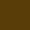
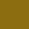

# Calculadora

Neste repositorio temos uma calculadora relativamente simples feita inteiramente com [React ](https://legacy.reactjs.org/).

O objetivo principal deste pequeno projeto é me desenvolver em construção de aplicações React, por isto, aqui tentarei utilizar ao máximo tudo que este Fremework tem a oferecer.

Além do React, também utilizarei [styled-components ](https://styled-components.com). Ela é uma biblioteca que possibilita escrever CSS dentro do javascript, acredito que sua utilização deixara a estilização muito mais dinâmica do que CSS puro, além de poder, adquirir mais conhecimento sobre tal ferramenta e experiência de desenvolvimento web.

## Temas

As paletas de cores utilizadas neste projeto foram feitas utilizando o [Adobe Colors](https://color.adobe.com/pt/create/color-wheel)!

Os temas deste site são constiuidos por cores personalizadas! Todas essas cores foram escolhidas para que o usuário tenha melhor familiaridade com o site. Dentre elas, existem algumas que são comuns entre todos os temas e estas são as cores carecterizam este site.

<<<<<<< HEAD
- **Cores padrão**

  <TABLE>
  <tr>
    <td>
      
      
#593D08

    </td>
    <td>
      
      
#593D08

    </td>
    <td>
      
      
#593D08

    </td>
    <td>
      
      
#593D08

    </td>
    <td>
      
      
#593D08

    </td>
  </tr>
  </table>
=======
- #### Cores padrão
>>>>>>> 0c7fd3110f6f54f91674d170bbf52e61c6a8866d

Como mostrado, existem muitas cores padrão utilizadas nesta calculadora, mas existem algumas que definem um tema espefico, como lite e dark mode.

Aqui estão as cores utilizadas em cada tema deste site:

- #### Lite mode

<<<<<<< HEAD
  <TABLE>
  <tr>
    <td>
      
      
#593D08

    </td>
    <td>
      
      
#593D08

    </td>
    <td>
      
      
#593D08

    </td>
    <td>
      
      
#593D08

    </td>
    <td>
      
      
#593D08

    </td>
  </tr>
  <tr>
    <td>
      
      
#593D08

    </td>
    <td>
      
      
#593D08

    </td>
    <td>
      
      
#593D08

    </td>
    <td>
      
      
#593D08

    </td>
    <td>
      
      
#593D08

    </td>
  </tr>
  </table>
=======
  

    

      
      
#F0F1FF

    

    

      
      
#F0F1FF

    

    

      
      
#F0F1FF

    

    

      
      
#F0F1FF

    

    

      
      
#F0F1FF

    

    

      
      
#F0F1FF

    

    

      
      
#F0F1FF

    

    

      
      
#F0F1FF

    

    

      
      
#F0F1FF

    

    

      
      
#F0F1FF

    

  

>>>>>>> 0c7fd3110f6f54f91674d170bbf52e61c6a8866d
