# Calculadora

Neste repositorio temos uma calculadora relativamente simples feita inteiramente com [React ](https://legacy.reactjs.org/).

O objetivo principal deste pequeno projeto é me desenvolver em construção de aplicações React, por isto, aqui tentarei utilizar ao máximo tudo que este Fremework tem a oferecer.

Além do React, também utilizarei [styled-components ](https://styled-components.com). Ela é uma biblioteca que possibilita escrever CSS dentro do javascript, acredito que sua utilização deixara a estilização muito mais dinâmica do que CSS puro, além de poder, adquirir mais conhecimento sobre tal ferramenta e experiência de desenvolvimento web.

## Temas

_As paletas de cores utilizadas neste projeto foram feitas utilizando o [Adobe Colors](https://color.adobe.com/pt/create/color-wheel)!_

Os temas deste site são constiuidos por cores personalizadas! Todas essas cores foram escolhidas para que o usuário tenha melhor familiaridade com o site. Dentre elas, existem algumas que são comuns entre todos os temas e estas são as cores carecterizam este site.

- **Cores padrão**

  <TABLE>
  <tr>
    <td>
      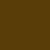
      
#593D08

    </td>
    <td>
      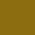
      
#F29F05

    </td>
    <td>
      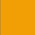
      
#8C6D0F

    </td>
    <td>
      
      
#F2B705

    </td>
    <td>
      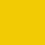
      
#F2CB05

    </td>
  </tr>
  </table>

Como mostrado, existem muitas cores padrão utilizadas nesta calculadora, mas existem algumas que definem um tema espefico, como lite e dark mode.

Aqui estão as cores utilizadas em cada tema deste site:

- **Lite mode**

  <TABLE>
  <tr>
    <td>
      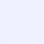
      
#F0F1FF

    </td>
    <td>
      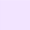
      
#F2E4FF

    </td>
    <td>
      
      
#D5CFE8

    </td>
    <td>
      
      
#CFD9E8

    </td>
    <td>
      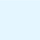
      
#E4F6FF

    </td>
  </tr>
  <tr>
    <td>
      
      
#B3C8F2

    </td>
    <td>
      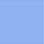
      
#91B2F2

    </td>
    <td>
      
      
#6B98F2

    </td>
    <td>
      
      
#4B83F2

    </td>
    <td>
      
      
#3071F2

    </td>
  </tr>
  </table>

  - **botões**
  <table>
  <tr>
    <td>
    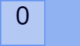
    

      Letra: #010021   
      Principal: #B3C8F2  
      Borda: #6B98F2   
      Corpo: #91B2F2
    

    <td>
    <td>
    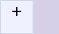
    

      Letra: #010021   
      Principal: #F0F1FF  
      Borda: #CFD9E8   
      Corpo: #D5CFE8
    

    <td>   
    <td>
    
    

      Letra: #F2CB05   
      Principal: #4B83F2  
      Borda: #91B2F2   
      Corpo: #3071F2
    

    <td>        
  </tr>
  </table>

- **Dark mode**

  <TABLE>
<tr>
  <td>
    
    
#023059

  </td>
  <td>
    
    
#023E73

  </td>
  <td>
    
    
#034C8C

  </td>
  <td>
    
    
#023E73

  </td>
  <td>
    
    
#00040D

  </td>
</tr>
<tr>
  <td>
    
    
#08090D

  </td>
  <td>
    
    
#1A1E26

  </td>
  <td>
    
    
#343A40

  </td>
  <td>
    
    
#6E7371

  </td>
  <td>
    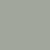
    
#A1A69C

  </td>
</tr>
</table>

- **botões**
<table>
<tr>
  <td>
  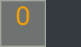
  

    Letra: #F2B705   
    Principal: #034C8C  
    Borda: #023E73   
    Corpo: #023059
  

  </td>
  <td>
  
  

    Letra: #F29F05   
    Principal: #6E7371  
    Borda: #A1A69C   
    Corpo: #343A40
  

  </td>   
  <td>
  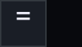
  

    Letra: #ECECF9   
    Principal: #1A1E26  
    Borda: #343A40   
    Corpo: #08090D
  

  </td>        
</tr>
</table>
